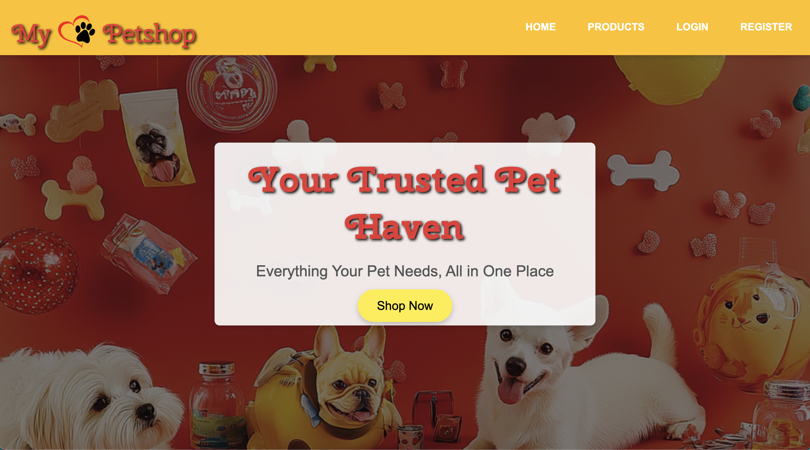
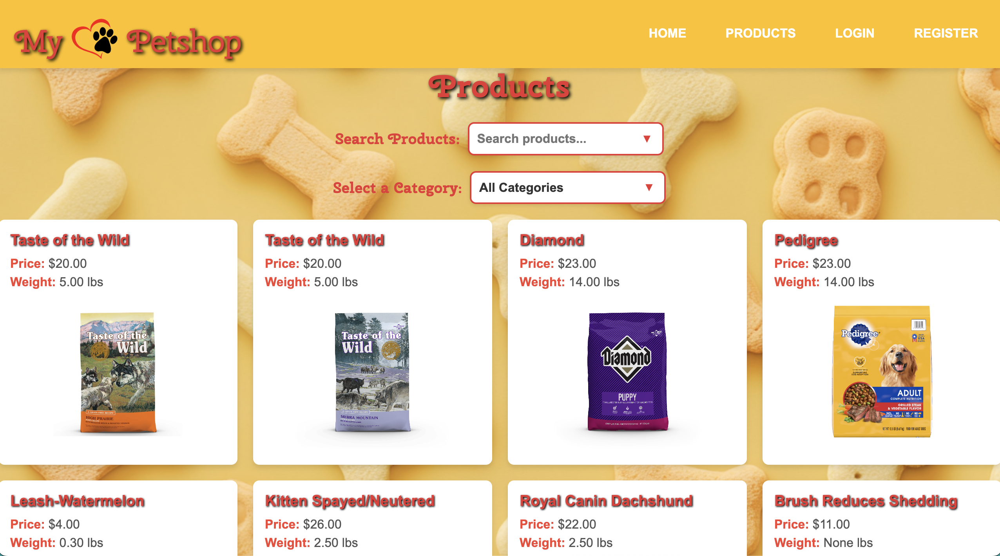
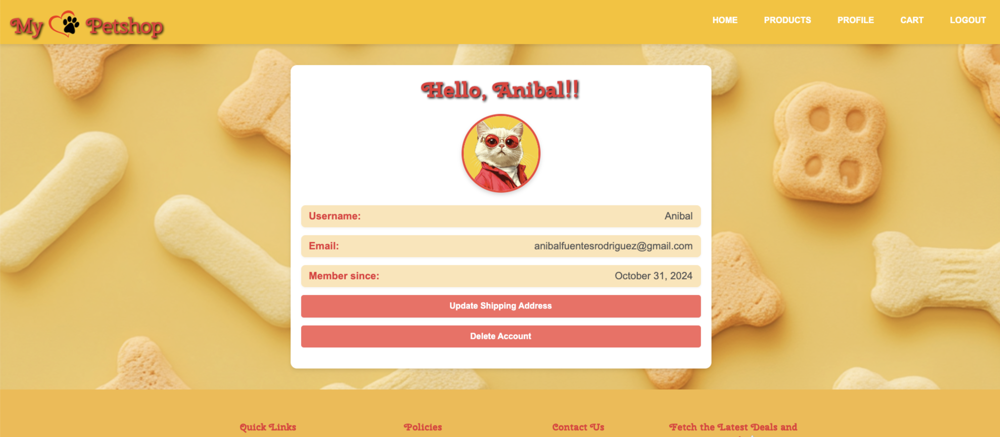

# My-PetShop

Welcome to My-PetShop! This project is a beautiful, engaging web application designed for pet lovers. Inspired by a family-run pet shop, we aimed to create a functional and eye-catching platform that captures the joy of being a pet owner.

## Table of Contents

- [About](#about)
- [Features](#features)
- [Technologies Used](#technologies-used)
- [Screenshots](#screenshots)
- [Contact](#contact)

## About

My-PetShop is an online platform where users can browse and purchase pet products. The application is designed to provide a seamless shopping experience with features like user authentication, profile management, and a shopping cart.

## Features

- User authentication (sign up, login, logout)
- User profile management
- Product listing and detail pages
- Shopping cart functionality
- Order management
- Email notifications
- Responsive design

## Technologies Used

- **Frontend:**
  - HTML
  - CSS
  - JavaScript

- **Backend:**
  - Django

- **APIs:**
  - Stripe (for payment processing)

## Screenshots

### Home Page

### Product Listing

### User Profile

## Contact

- **Project Maintainers:**
  - [Anibal Fuentes](https://github.com/anibalfuentesrod)
  - [Kryss Babilonia](https://github.com/kryssbm99)

- **Follow Anibal:**
  - [LinkedIn](https://www.linkedin.com/in/anibal-fuentes-b75443315/)
  - [GitHub](https://github.com/anibalfuentesrod)

- **Follow Kryss:**
  - [LinkedIn](https://www.linkedin.com/in/kryssbm99/)
  - [GitHub](https://github.com/kryssbm99)

---

Thank you for visiting My-PetShop! We hope you enjoy exploring our application as much as we enjoyed building it.